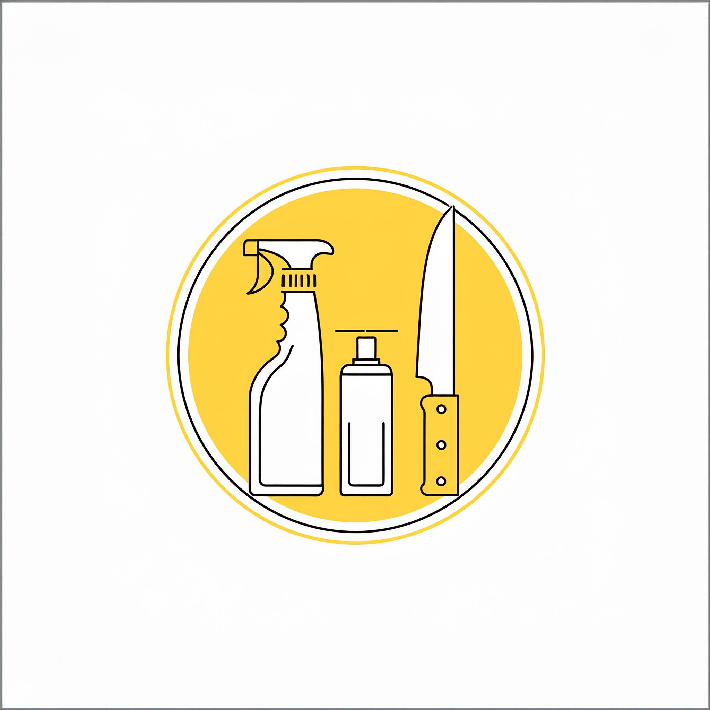

<!-- Logo -->
<br />
<div align="center">
  <a href="https://github.com/zibodsun/Kitchen-Safety-Training">
    
  </a>

  <h3 align="center">Training for commercial kitchen workers</h3>

  <p align="center">
    <br />
    <a href="https://mandesrushtixr.wixsite.com/kitchentraining"><strong>Explore the docs »</strong></a>
    <br />
    <br />
    <a href="https://mandesrushtixr.wixsite.com/kitchentraining">View Website</a>
    ·
    <a href="https://github.com/zibodsun/Kitchen-Safety-Training/issues">Report Bug</a>
    ·
    <a href="https://github.com/zibodsun/Kitchen-Safety-Training/issues">Request Feature</a>
  </p>
</div>

### Watch Full Video Here
[](https://youtu.be/l04AciU2S5o)

<!-- Table of Contents -->
<details>
  <summary>Table of Contents</summary>
  <ol>
    <li>
      <a href="#kitchen-safety-training">About The Project</a>
      <ul>
        <li><a href="#built-with">Built With</a></li>
      </ul>
    </li>
    <li>
      <a href="#getting-started">Getting Started</a>
      <ul>
        <li><a href="#dependencies">Dependencies</a></li>
        <li><a href="#installation---unity-project">Installation - Unity Project</a></li>
        <li><a href="#installation---application-only">Installation - Application Only</a></li>
      </ul>
    </li>
    <li><a href="#contributing">Contributing</a></li>
    <li><a href="#contact">Contact</a></li>
    <li><a href="#acknowledgments">Acknowledgments</a></li>
  </ol>
</details>

# Kitchen Safety Training

A VR training application about Safety and Hygiene practices in professional kitchens.

### Built With

* [Unity](https://unity.com/)

## Getting Started

### Dependencies

* Developed for Meta Quest devices.
* Tested on Meta Quest 3.
* Unity 2022.3.11 with Android Support

### Installation - Unity Project

1. Set up the [Android Environment](https://docs.unity3d.com/Manual/android-sdksetup.html)
2. Clone the repo
   ```sh
   git clone https://github.com/zibodsun/EmpathyMachine
   ```
3. Open the project using Unity Hub

### Installation - Application Only

1. Simply download the [.apk build](https://github.com/zibodsun/EmpathyMachine/releases) and sideload onto device.

## Contributing

If you have a contribution that would make this better, please fork the repo and create a pull request.

1. Fork the Project
2. Create your Feature Branch (`git checkout -b feature/AmazingFeature`)
3. Commit your Changes (`git commit -m 'Add some AmazingFeature'`)
4. Push to the Branch (`git push origin feature/AmazingFeature`)
5. Open a Pull Request

## Contact

This application was developed by students from Swansea University as a part of the EG-M130 module.

* Srushti: 2334306@swansea.ac.uk
* Zibo: 2357888@swansea.ac.uk

## Acknowledgments
### Credits to used assets
* Wall Material: https://assetstore.unity.com/packages/2d/textures-materials/50-free-pbrmaterials-242760
* Steel Table: https://sketchfab.com/3d-models/loft-console-table-160x40x110-
8ca93f070a0d42e08e7ad38b0698ffc1
* Industrial Kitchen Stove: https://www.cgtrader.com/free-3d-models/interior/kitchen/kitchenequipment-f0336dfa-1f48-4db1-aedb-7b542bd1d4bc
* Steel Sink: https://sketchfab.com/3d-models/sink-e57b59b6037643a99662316493a831da
* Microwave: https://www.poliigon.com/model/stainless-steel-microwave-model/7780
* Utensil Jar: https://www.poliigon.com/model/wooden-utensils-jar-model/3441
* Tiles Texture: https://www.poliigon.com/texture/glossy-large-square-ceramic-tiles-texturewhite/6956
* Utensil Box: https://www.cgtrader.com/free-3d-models/household/kitchenware/kitchenutensil-box
* Wet Floor Sign: https://sketchfab.com/3d-models/wet-floor-signd340f904c4684645a4e5282b5fbe963b
* Low Poly Metal Rak: https://assetstore.unity.com/packages/3d/props/furniture/low-polymetal-rack-213045
* Food Container: https://sketchfab.com/3d-models/cc0-food-container-4-
03749821e3a9441e9868fea0a7d991cc
* Mop Set: https://sketchfab.com/3d-models/mop-with-bucket1f8a9519827e44159c6ffe9eb4b4a2f8
* Food pack: https://assetstore.unity.com/packages/3d/props/food/food-pack-mixed-154349
* Kitchen door: https://sketchfab.com/3d-models/warehouse-doorsc35bcce819c64079b26bd2f4d1c11096
* Fire extinguisher : https://sketchfab.com/3d-models/fire-extinguisher5676b179b3b744c0aaae53a3dcea2300
* https://polygone.art/#page=Model&guid=8t1DZLLvofk
* https://sketchfab.com/3d-models/cutting-board06c94ce2e7b84a29ac3bc848b4f862bf#download
* https://www.turbosquid.com/3d-models/spray-bottle-3d-1508629
* Audience Clapping: https://pixabay.com/sound-effects/audience-clapping-03-99963/
* Corporate Presentation Music: https://pixabay.com/music/corporate-presentation-music164836/
* https://pixabay.com
* https://www.1001fonts.com/brownbaglunch-font.html
* https://www.texturecan.com/details/172/
* https://uxwing.com
